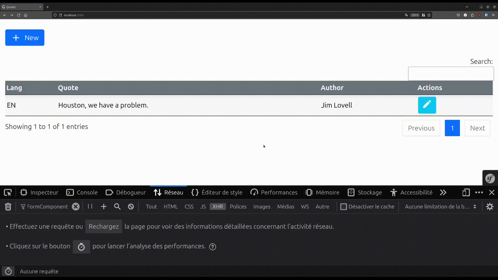
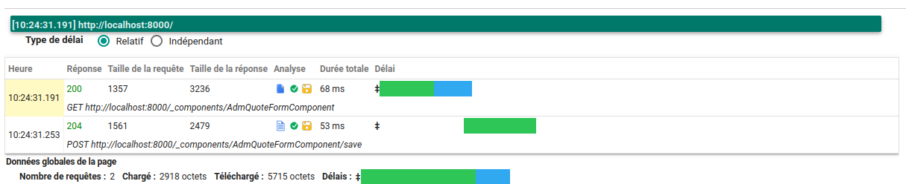

# Live-Component form race ajax call issue

1. [Project](#Project)
2. [Installation](#Installation)
3. [Stop the project](#Stop-the-project)
4. [Usage](#Usage)
5. [Demo](#Demo)
6. [Tests](#Tests)

### Project

- Docker
- PHP 8.1
- Symfony 5.4
- Apache
- Postgres
- HTTP/1.1

### Installation

- `make start`

### Stop the project

- `make stop`

### Usage

1. Go to http://127.0.0.1:8000
2. You'll have a table (handled by DataTables) which contains one row
3. Click on the “Edit” button (with a pencil).
4. You can edit any form field you want
5. Submit the form
6. Check if in the table, the value is correctly updated
    - Sometimes it will, sometimes it won't

### Demo

- Network

### Tests

- Use PHP-FPM and HTTP/2
  - Reduce a lot the number of times the problem occurs, but still occurs from time to time
